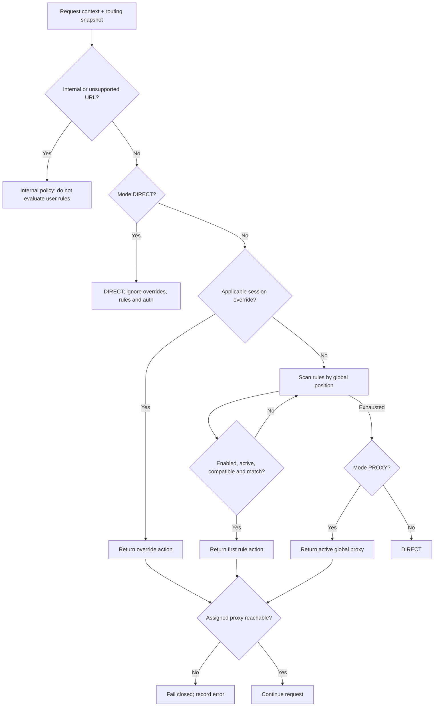
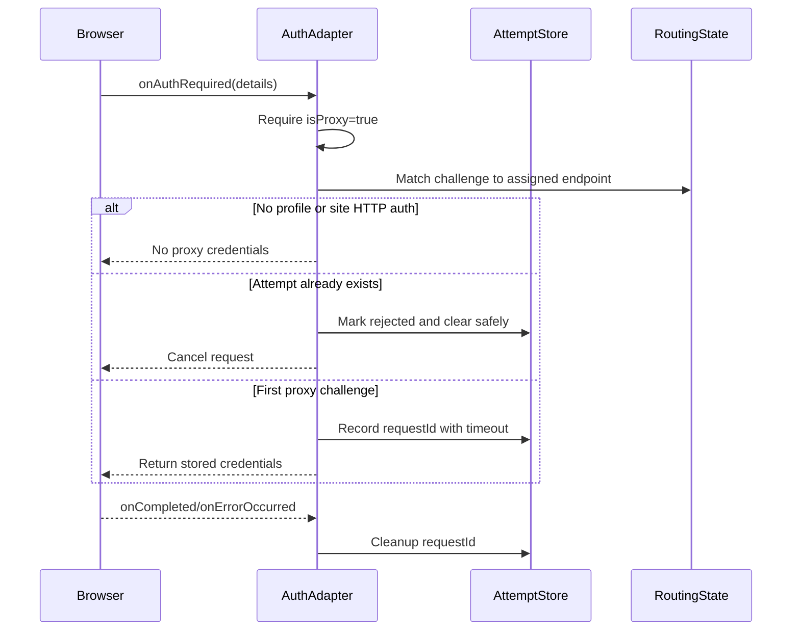
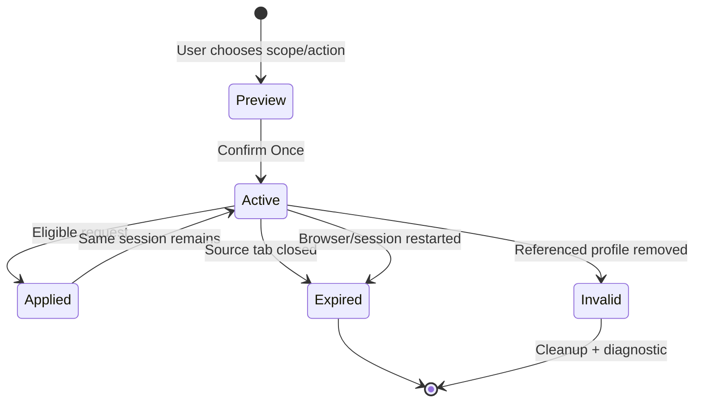
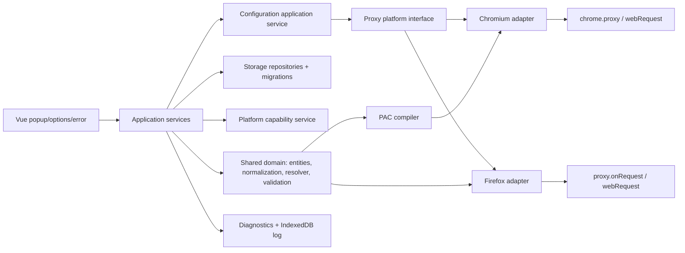

# ProxyLoom — Product Requirements Document

## 1. Название и статус документа

**Продукт:** ProxyLoom  
**Документ:** PRD  
**Статус:** базовая спецификация первой версии, готовая к техническим spikes и реализации  
**Язык документа:** русский  
**Язык интерфейса:** только английский, через систему локализации с `en` по умолчанию  
**Целевой стек:** WXT, Vue 3, TypeScript strict, Composition API, `<script setup>`, Manifest V3

Этот документ является источником истины для продуктовой семантики. `ProxyLoom` — рабочее отображаемое название; оно хранится в централизованной конфигурации и не используется как namespace схемы данных, ключей хранилища или экспортного формата.

## 2. Executive summary

ProxyLoom — кроссбраузерное расширение для явного и предсказуемого управления HTTP- и HTTPS-прокси. Оно предоставляет три недублирующихся режима (`DIRECT`, `PROXY`, `RULES`), ordered ruleset с семантикой first match, постоянные и временные site overrides, раздельные HTTP/HTTPS endpoints, диагностику, безопасный импорт/экспорт и современный английский интерфейс.

Одна доменная модель и чистый resolver используются во всех пользовательских и платформенных сценариях. Chromium применяет inline PAC через `chrome.proxy`; Firefox выбирает маршрут через `proxy.onRequest`. Различия скрыты за платформенными адаптерами и capability service. Если назначенный прокси недоступен, скрытого перехода на прямое соединение нет. Ограничения браузерных API показываются в UI и документируются, а не маскируются.

Первая поставка включает два ZIP: Chromium и Firefox. Chromium ZIP предназначен также для Edge и Яндекс Браузера. Автоматическая публикация в магазины не выполняется.

## 3. Проблема

Пользователям нескольких прокси приходится выбирать между глобальными переключателями без удобных исключений и сложными rule managers, где приоритет, fallback и фактически применённый маршрут неочевидны. Кроссбраузерные различия дополнительно создают ложные ожидания: Chromium PAC не эквивалентен Firefox request listener, а ошибки и авторизация обрабатываются по-разному.

ProxyLoom решает проблему через:

- три однозначных режима;
- детерминированный глобальный порядок правил;
- явное отображение effective route и matched rule;
- fail-closed для назначенного прокси;
- диагностируемые ошибки;
- переносимые Origin Rules и явно Firefox-only Full URL Rules;
- отсутствие скрытой телеметрии и фоновых proxy checks.

## 4. Цели

- `FR-001`: пользователь может выбрать `DIRECT`, `PROXY` или `RULES`, и результат соответствует таблице решений.
- `FR-002`: пользователь может создать, изменить, проверить, продублировать и удалить несколько proxy profiles.
- `FR-003`: пользователь может управлять глобально упорядоченными Origin и Full URL rules.
- `FR-004`: popup показывает текущий effective route, matched rule, proxy profile и актуальную ошибку.
- `FR-005`: пользователь может создать для текущего сайта временное действие `Once` или постоянное `Always`.
- `FR-006`: назначенный прокси применяется без скрытого `DIRECT`, system proxy или другого proxy fallback.
- `FR-007`: пользователь может вручную проверить прокси и увидеть availability, duration, external IP, country и HTTP status.
- `FR-008`: пользователь может импортировать/экспортировать нативную конфигурацию и импортировать только proxy profiles из FoxyProxy.
- `FR-009`: пользователь может диагностировать проблемы по error page, badge, control status и локальному журналу.
- `COMPAT-001`: один shared domain поддерживает Chrome, Chromium, Edge, Яндекс Браузер и Firefox через отдельные адаптеры.

## 5. Non-goals

В первую версию не входят: SOCKS4/5; proxy chains; fallback proxy; automatic rotation; cloud/browser-account sync; accounts; subscriptions; payments; analytics; telemetry; crash reporting на внешний сервер; remote management; team sharing; mobile browsers; Safari; автоматическая публикация в магазины; rule subscriptions; пользовательский remote PAC/PAC URL; automatic proxy health polling; encrypted master-password vault; URL-content filtering; ad blocking; request-header modification; traffic decryption; VPN; QUIC/MASQUE proxy.

- `FR-010`: приложение не предлагает и не имитирует перечисленные функции.
- `REL-001`: release workflow создаёт артефакты, но не публикует их автоматически в browser stores.

## 6. Целевые пользователи

1. Разработчик или тестировщик, направляющий рабочие и локальные сайты через разные прокси.
2. Пользователь нескольких региональных прокси, которому нужны понятные исключения.
3. Администратор собственного браузерного профиля, которому важны диагностика и предсказуемый fail-closed.
4. Опытный пользователь FoxyProxy, переносящий proxy profiles без автоматического переноса неоднозначных patterns.

Пользователь понимает, что HTTP/HTTPS proxy не является VPN и что локально сохранённые credentials не защищены master password.

## 7. Основные use cases

1. Включить аварийный `DIRECT`, сохранив правила и профили.
2. Назначить один глобальный прокси, но открыть отдельные сайты напрямую или через другой профиль.
3. Оставить direct default и проксировать только совпавшие сайты.
4. Через popup направить текущий origin через профиль один раз или всегда.
5. Временно отключить правило на 5/15 минут, 1 час или до рестарта.
6. Проверить регулярное выражение на одном или многих URL до сохранения.
7. Понять, какое правило сработало, какой маршрут запланирован и почему возникла ошибка.
8. Вручную проверить неактивный профиль, не переключая незаметно весь браузер.
9. Экспортировать настройки без credentials по умолчанию и безопасно восстановить их.
10. Импортировать поддерживаемые HTTP/HTTPS profiles из современной FoxyProxy JSON-конфигурации.

## 8. Термины

| Термин             | Однозначное значение                                                                                      |
| ------------------ | --------------------------------------------------------------------------------------------------------- |
| Target scheme      | Протокол целевого URL: `http`, `https`, `ws` или `wss`.                                                   |
| Proxy transport    | Протокол соединения браузера с proxy server: `HTTP` или `HTTPS`. Не равен target scheme.                  |
| Proxy profile      | Именованная конфигурация endpoints, credentials и диагностических метаданных.                             |
| Origin target      | Нормализованная строка `scheme://hostname[:port]/` без path/query/fragment/credentials.                   |
| Full URL target    | URL сетевого запроса с scheme/host/port/path/query, но без fragment.                                      |
| Rule               | Matcher плюс действие `DIRECT` или `PROXY(profileId)`.                                                    |
| First match        | Первое сверху совместимое, enabled и не временно отключённое совпавшее правило завершает поиск.           |
| Effective route    | Итог resolver с источником решения, действием и proxy profile.                                            |
| Routing snapshot   | Иммутабельная, валидированная, нормализованная конфигурация для resolver/адаптера/PAC.                    |
| Temporary override | Session-only действие для origin с приоритетом выше постоянных правил.                                    |
| Fail-closed        | Ошибка назначенного прокси завершает запрос ошибкой; прямой/system/другой proxy fallback не используется. |
| Permanent disabled | `enabled=false`, сохранено в обычной конфигурации.                                                        |
| Temporary disabled | Отдельное session/expiry-состояние; не меняет `enabled`.                                                  |
| Compatible rule    | Origin Rule везде; Full URL Rule только в Firefox.                                                        |

## 9. Поддерживаемые браузеры

| Цель            | Сборка           | Routing API                 | Уровень поддержки            |
| --------------- | ---------------- | --------------------------- | ---------------------------- |
| Google Chrome   | Chromium MV3 ZIP | `chrome.proxy` + inline PAC | основной                     |
| Chromium        | Chromium MV3 ZIP | совместимый `chrome.proxy`  | основной                     |
| Microsoft Edge  | Chromium MV3 ZIP | совместимый `chrome.proxy`  | release verification         |
| Яндекс Браузер  | Chromium MV3 ZIP | совместимый `chrome.proxy`  | release verification         |
| Mozilla Firefox | Firefox MV3 ZIP  | `browser.proxy.onRequest`   | основной, с явными отличиями |

- `COMPAT-002`: Full URL Rule исполняется только Firefox; Chromium пропускает его и продолжает поиск.
- `COMPAT-003`: Edge и Яндекс Браузер используют неизменённый Chromium ZIP.
- `COMPAT-004`: минимальные версии браузеров фиксируются после spikes по MV3, permissions и lifecycle.
- `COMPAT-005`: невозможная на платформе функция не эмулируется ложным состоянием; capability service управляет предупреждением и доступностью controls.

## 10. Functional requirements

### 10.1 Общая конфигурация

- `FR-011`: product name, support links, store IDs и defaults находятся в централизованной build/runtime-конфигурации.
- `FR-012`: UI сразу использует `_locales/en/messages.json` или эквивалент WXT i18n; literal user-facing strings запрещены вне каталога локализации.
- `FR-013`: global settings включают mode, active proxy, logging, log level, check timeout, IP/GeoIP provider, error-page behavior, confirmations, appearance.
- `FR-014`: при startup service worker восстанавливает конфигурацию из persistent storage, очищает истёкшее session state и повторно применяет effective configuration.

### 10.2 Маршрутизация

- `FR-015`: HTTP и `ws://` используют HTTP endpoint выбранного профиля.
- `FR-016`: HTTPS и `wss://` используют HTTPS endpoint выбранного профиля.
- `FR-017`: URL загрузки маршрутизируется по target scheme тем же resolver.
- `FR-018`: internal extension requests, browser-internal schemes и proxy-check traffic исключены из пользовательских rules/logging по явной классификации.
- `FR-019`: invalid proxy reference никогда не превращается в `DIRECT`; resolver возвращает диагностируемую ошибку конфигурации.
- `FR-020`: быстрые изменения конфигурации coalesce, устаревший apply не может перезаписать новый snapshot.

### 10.3 Управление

- `FR-021`: proxy control status принимает `controlled-by-this-extension`, `controllable`, `controlled-by-other-extension`, `controlled-by-policy`, `not-controllable`.
- `FR-022`: при отсутствии контроля routing controls блокируются, UI не показывает ложное active state и не пытается бесконечно отвоёвывать настройку.
- `FR-023`: control status проверяется при startup, перед apply и при изменении browser proxy settings.

### 10.4 Диагностика

- `FR-024`: ошибка прокси связывается с request/tab/routing decision настолько, насколько позволяет API, без credentials и полного URL.
- `FR-025`: badge пересчитывается при mode/config/error change и смене активной вкладки.
- `FR-026`: все destructive actions имеют preview/impact и подтверждение в соответствии с general setting.

## 11. Routing modes

### 11.1 `DIRECT`

Аварийное полное отключение маршрутизации ProxyLoom: поддерживаемый трафик идёт напрямую; rules, proxy auth и temporary overrides игнорируются; данные не удаляются. Chromium использует настоящий `direct` proxy mode. Firefox обязан подтвердить реальный direct при наличии browser-defined proxy в spike; если API не позволяет его гарантировать без получения контроля над settings, UI показывает limitation/control conflict.

### 11.2 `PROXY`

Пользователь выбирает обязательный global proxy profile. Resolver сначала проверяет постоянные rules сверху вниз. Совпавшее правило назначает `DIRECT` или любой существующий proxy profile. При отсутствии match используется global proxy. Temporary override, если он применим на платформе, имеет приоритет выше rules. Назначенный proxy fail-closed.

### 11.3 `RULES`

Global proxy default отсутствует. Resolver проверяет rules сверху вниз; совпавшее правило назначает `DIRECT` или proxy. При отсутствии match используется `DIRECT`. Temporary override имеет приоритет выше rules. Назначенный proxy fail-closed.

- `FR-027`: mode values хранятся как стабильные внутренние enum, не как локализованные labels.
- `FR-028`: `PROXY` нельзя активировать без существующего active proxy profile.
- `FR-029`: переход между режимами не удаляет rules, profiles или overrides; `DIRECT` лишь не применяет overrides.

## 12. Routing decision table

| Mode     | Applicable temporary override | First compatible rule | No match            | Proxy failure        |
| -------- | ----------------------------- | --------------------- | ------------------- | -------------------- |
| `DIRECT` | игнорируется                  | игнорируется          | `DIRECT`            | не применимо         |
| `PROXY`  | override action               | rule action           | active global proxy | ошибка, без fallback |
| `RULES`  | override action               | rule action           | `DIRECT`            | ошибка, без fallback |

Дополнительные строки:

| Состояние                               | Решение                                                                                            |
| --------------------------------------- | -------------------------------------------------------------------------------------------------- |
| Full URL Rule в Chromium                | incompatible → продолжить со следующим rule                                                        |
| Disabled/temporarily disabled rule      | пропустить                                                                                         |
| Rule с удалённым `profileId` совпал     | configuration error, не `DIRECT`                                                                   |
| Override с удалённым `profileId`        | invalid override удаляется/диагностируется; затем normal resolution, никогда скрытая замена action |
| Несуществующий global profile в `PROXY` | configuration error; конфигурация не применяется                                                   |
| Extension/internal URL                  | bypass domain resolver согласно internal request policy                                            |



## 13. Rule engine

Resolver — чистая синхронная domain-функция без browser API, storage и clock access. Clock/platform/request facts передаются аргументами. Он возвращает structured decision: action, source, matchedRule, profile, normalizedTarget, compatibility и diagnostics.

- `FR-030`: rules сортируются только по числовой глобальной позиции; категории, specificity и
  скрытые tie-breakers отсутствуют.
- `FR-031`: первое совпадение завершает evaluation; specificity и скрытые tie-breakers отсутствуют.
- `FR-032`: учитываются `enabled`, temporary disable expiry, compatibility, validity и matcher.
- `FR-033`: reorder выполняется атомарно и перенумеровывает глобальные позиции детерминированно.
- `FR-034`: при search/filter drag-and-drop отключён; UI показывает `Clear filters to reorder rules`.
- `FR-035`: удаление используемого profile не удаляет rules; после подтверждения они становятся invalid и видимыми.
- `FR-036`: temporary disable предлагает `5 minutes`, `15 minutes`, `1 hour`, `Until browser restart`; permanent `enabled` не меняется.
- `FR-037`: routing tester показывает trace проверенных rules, первое совпадение, итоговое действие/profile и mode fallback. Он входит в v1, поскольку повторно использует resolver.

Regex policy:

- допустимые flags v1: пустая строка, `i`, `m`, `im` в каноническом порядке; `g`, `y`, `s`, `u`, `v`, `d` не принимаются до результатов compatibility spike;
- default — `i`;
- максимальная длина pattern — 2 048 UTF-16 code units; limit конфигурируем и может быть уменьшен spike;
- синтаксис проверяется через безопасный wrapper `RegExp`, без `eval`;
- heuristic/static analyzer отклоняет известные nested-quantifier/backreference риски либо требует упрощения;
- tester выполняется в worker или chunked/cancellable execution с time budget; зависший batch прерывается;
- PAC compiler сериализует AST/snapshot, использует JSON-safe literals/генератор и никогда не конкатенирует raw pattern в executable context.

- `SEC-001`: PAC generator устойчив к quote/newline/backslash/Unicode injection.
- `SEC-002`: regex сохраняется только после syntax, flag, length и safety validation.
- `NFR-001`: resolver детерминирован для одинаковых input snapshot/context.

## 14. Origin и Full URL rules

### 14.1 Origin Rule

Переносим на все браузеры и единственный тип, компилируемый в Chromium PAC. Target:

`scheme://hostname[:port]/`

Нормализация:

- scheme/hostname lower case;
- IDN → ASCII/Punycode через стандартный URL parser;
- default port (`80` для `http/ws`, `443` для `https/wss`) удаляется;
- non-default port сохраняется;
- trailing `/` обязателен;
- path/query/fragment/URL credentials исключаются;
- malformed, internal и unsupported URLs дают typed validation result.

### 14.2 Full URL Rule

Matcher Firefox-only. Target включает scheme, hostname, explicit/non-default port, path и query; fragment исключён. Chromium пропускает правило, сохраняет его при import/export и показывает badge `Firefox only` с причиной несовместимости.

Решение UX: в Chromium создание Full URL Rule доступно в advanced section редактора, но до выбора пользователь видит warning `Full URL rules work in Firefox only.` и должен явно подтвердить. Это лучше полного скрытия: конфигурацию можно заранее подготовить и переносить, но случайное создание затруднено.

- `FR-038`: regex helper объясняет anchors, escaped dots, optional ports, subdomains, schemes, различия Origin/Full URL и Firefox-only path matching.
- `FR-039`: templates: exact hostname; domain + subdomains; exact origin; HTTP only; HTTPS only; custom port; localhost; private IPv4; Firefox-only path; Firefox-only query parameter.
- `FR-040`: template только генерирует editable expression; сохранение проходит обычную validation.
- `COMPAT-006`: нельзя обещать Chromium Full URL routing через post-selection `webRequest`.

## 15. Proxy profiles

Профиль содержит два endpoint slots: `httpEndpoint` и `httpsEndpoint`. При `useSameProxy=true` HTTPS route ссылается на копию/эффективное значение HTTP endpoint, но storage сохраняет однозначную canonical model. Endpoint содержит proxy transport `HTTP|HTTPS`, host, port, username, password. В UI credentials могут вводиться на endpoint; domain model дедуплицирует одинаковые credentials только как implementation detail, не меняя UX.

- `FR-041`: profile CRUD, duplicate, color, note, check URL, short name и impact view.
- `FR-042`: short name 1–3 отображаемых ASCII alphanumeric characters; если отсутствует, генерируется детерминированно из name с устранением коллизии в badge display.
- `FR-043`: manual check result сохраняется только как последний result, не как периодическая история.
- `FR-044`: check URL валидируется как public `http/https` URL; internal/local targets требуют отдельного предупреждения.
- `FR-045`: удалить используемый profile можно только после impact preview и explicit confirmation.

Credentials notice, дословно:

`Proxy credentials are stored locally by the browser extension and are not protected by a master password.`

## 16. Authentication

Auth adapter слушает proxy challenge, проверяет `isProxy`, сопоставляет challenger host/port и effective route с profile endpoint, затем возвращает credentials не более одного раза на `requestId`.



- `FR-046`: обычный site HTTP auth никогда не получает proxy credentials.
- `FR-047`: вторая challenge для того же request ID означает rejection, запрос отменяется, возникает `Proxy authentication failed`.
- `FR-048`: attempt state удаляется по `onCompleted`, `onErrorOccurred` и timeout; startup очищает stale state.
- `FR-049`: main-frame auth failure запускает best-effort error page; background/WebSocket/download failure попадает в log, download также в notification.
- `COMPAT-007`: Chromium MV3 использует `webRequestAuthProvider` и `asyncBlocking` callback; Firefox использует совместимый адаптер и проверенные permissions.
- `SEC-003`: username/password отсутствуют в logs, diagnostics, errors, telemetry и console.

## 17. Popup

Popup компактно показывает:

- global mode и active global proxy;
- current site/origin;
- effective route, matched rule и effective proxy;
- compatibility/control warning;
- последнюю актуальную ошибку;
- список profiles;
- `Open Settings`.

Controls: segmented `DIRECT / PROXY / RULES`, global profile selector, `Use Proxy for This Site`, `Open Directly`, `Edit Rule`, quick global profile selection, `Retry`.

- `FR-050`: global profile click явно помечен `Use Globally` и переводит mode в `PROXY`; site action находится отдельно и всегда открывает `Once / Always`.
- `FR-051`: для unsupported/internal tab site actions disabled с объяснением.
- `FR-052`: popup не показывает перегруженную таблицу и получает единый inspection result из resolver.

Badge:

| Состояние                       | Text               | Цвет                    |
| ------------------------------- | ------------------ | ----------------------- |
| `DIRECT`                        | `D`                | нейтральный             |
| `PROXY`                         | profile short name | profile color           |
| `RULES`, proxy route active tab | `R`                | effective profile color |
| `RULES`, direct active tab      | `R`                | нейтральный             |
| актуальная proxy error          | `!`                | error color             |

Имя/short name всегда доступно рядом с profile color: цвет не единственный идентификатор.

## 18. Options page

Навигация: `General`, `Proxies`, `Rules`, `Logs`, `Import & Export`, `Appearance`, `About / Diagnostics`.

### General

Mode, active proxy, logging enabled, log level, check timeout, default IP/GeoIP endpoint, GeoIP toggle, error page behavior, confirmations, incognito instructions/status, proxy control status.

### Proxies

CRUD/duplicate/delete, color, endpoints, credentials notice, manual check, last result, referring rules и delete impact.

### Rules

Ordered list, DnD, enable, temporary disable, duplicate/edit/delete, invalid state, search и filters
по action/profile/compatibility/enabled. Filtered view read/review-only для order.

### Logs

Paginated/virtualized view, search/filter/clear/pause, planned route, actual proxy info when available, links to rule/profile.

### Import & Export

Native JSON и FoxyProxy profiles-only workflows с preview/result.

### Appearance

`System`, `Light`, `Dark`.

### About / Diagnostics

App/browser/build versions, capabilities, proxy control, storage schema versions, safe copyable diagnostics без URL path/query/credentials и ссылки на privacy/support.

- `FR-053`: options сохраняет изменения через application service, а не напрямую в storage.
- `FR-054`: validation messages, empty states и confirmation text полностью английские и локализуемые.

## 19. Error page

Best-effort page только для main-frame:

- title/reason/technical code;
- profile name;
- target hostname, без path/query;
- matched rule;
- timestamp;
- `Retry`;
- `Switch Proxy`;
- `Open Directly Once`;
- `Open Settings`.

`Switch Proxy` предлагает `Once`/`Always`. `Open Directly Once` создаёт temporary DIRECT override и повторяет navigation. Chromium показывает:

`This temporary override may also affect other tabs using the same site.`

- `FR-055`: redirect guard предотвращает loops и никогда не обрабатывает extension/internal requests.
- `FR-056`: background/subresource/WebSocket error не открывает page; download error использует notification + log.
- `COMPAT-008`: error page не считается гарантированной заменой native page: post-failure events не предоставляют атомарного redirect, tab может быть закрыт/перенаправлен, а часть сетевых ошибок не содержит достаточно стабильной корреляции. UI и тесты называют это best effort.

## 20. Temporary overrides

Пользователь каждый раз выбирает match scope:

- `Exact hostname`;
- `Domain and all subdomains`.

Registrable domain вычисляется локальной PSL library. IP, localhost, public suffix и malformed hosts обрабатываются отдельно; наивное удаление label запрещено.

`Always` показывает generated regex/action и создаёт permanent Origin Rule. `Once` создаёт session-only override, связанный с source tab, выше rules, удаляемый по tab close и browser restart.



- `FR-057`: Firefox использует tab-specific override по reliable `tabId`; speculative/invalid tab context не наследует override.
- `COMPAT-009`: Chromium PAC не имеет надёжного tab ID, поэтому override фактически origin-scoped во всех вкладках до закрытия source tab; warning показывается в popup/error page.
- `FR-058`: normal/private session overrides не смешиваются.
- `FR-059`: temporary disabled rules и temporary overrides используют session storage/эквивалент и alarms/reconciliation, а не только globals service worker.

## 21. Logging

Logging включён по умолчанию, режим `Navigations and failures`. Второй режим — `All supported requests`. Максимум 1000 entries, IndexedDB ring buffer, batched writes.

Entry может содержать timestamp, request type, hostname, scheme, internal correlation tab ID, mode, matched rule ID/name, planned action/profile, actual proxy info if available, HTTP status, total duration, error code, auth failure, platform. Никогда не содержит path/query/fragment/body/headers/cookies/authorization/proxy credentials.

- `FR-060`: logging можно полностью отключить; после отключения новые entries не создаются.
- `FR-061`: `Pause logging` влияет только на collection, не на routing.
- `FR-062`: oldest entries удаляются при превышении 1000; clear атомарно очищает persistent и view cache.
- `PRIV-001`: private/incognito logs только in-memory, очищаются с private session; persistent IndexedDB не используется.
- `PRIV-002`: hostname хранится полностью; UI объясняет это до включения расширенного режима.

## 22. Proxy check

Check запускается только явным user action и показывает:

- availability;
- total duration;
- connect duration либо `Not available`;
- external IP;
- country либо disabled/unavailable;
- HTTP status check URL;
- safe error message;
- last checked at.

Provider interface отделяет request, timeout, schema validation и mapping. Выбранный default candidate: `https://api.country.is/`. Актуальная документация описывает HTTPS JSON API без ключа, поля `ip`/`country`, открытый исходный код и отсутствие request logs; реальный ответ при подготовке PRD содержал `Access-Control-Allow-Origin: *`. Поставке предшествует spike с fetch из extension context, proxy routing, повторной проверкой CORS/privacy/availability и fallback UX. UI до запроса явно показывает endpoint, GeoIP можно выключить или заменить provider, а запрос выполняется только вручную. Если review не пройден, default остаётся пустым и пользователь задаёт endpoint сам.

- `FR-063`: provider получает сетевой запрос через проверяемый profile, но не сохранённые credentials как payload/header приложения; proxy auth остаётся browser-level.
- `FR-064`: malformed/oversized response, timeout, non-2xx и invalid IP/country дают typed failure.
- `FR-065`: Chromium inactive-profile check исследует temporary high-priority PAC override только для origins check/IP endpoints, сериализует одну проверку, сохраняет prior snapshot, восстанавливает его в `finally` и на startup recovery.
- `FR-066`: internal test requests не попадают в user log.
- `PRIV-003`: endpoint и передаваемые ему данные объясняются до check; фоновых/periodic calls нет.

## 23. Import/export

### 23.1 Native JSON

Envelope: stable `format`, `schemaVersion`, `exportedAt`, `appVersion`, profiles, rules, general
settings, appearance. Не зависит от display product name. Импорт schema v1 удаляет старые group
metadata и неизменённые встроенные demo rules, сохраняя пользовательские/изменённые rules и их
относительный глобальный порядок.

Workflow: size limit → parse as inert data → schema validation → migration in memory → duplicate analysis → preview → `Merge` или confirmed `Replace` → transactional write/rollback → report.

- `FR-067`: credentials не экспортируются по умолчанию; checkbox `Include proxy credentials` сопровождается explicit warning.
- `FR-068`: import credentials только если они присутствуют и schema-valid.
- `FR-069`: merge не перезаписывает сущности молча; IDs remap, references update, duplicate decisions показываются в preview.
- `FR-070`: replace требует отдельного confirmation и backup; partial application запрещена.

### 23.2 FoxyProxy

Adapter parsers распознают только документированные/fixture-backed современные JSON variants и
извлекают HTTP/HTTPS proxy profiles. Rules, patterns, vendor grouping metadata, subscriptions, logs
и vendor settings не импортируются. Preview показывает found profiles, unsupported/skipped entries
и name collisions. Ноль импортированных profiles — failure.

- `FR-071`: duplicate names получают deterministic suggested rename и user-confirmed resolution.
- `FR-072`: обещание поддержки всех исторических форматов отсутствует.

## 24. Incognito

- `FR-073`: UI показывает browser-specific инструкцию, если пользователь не разрешил incognito/private access; расширение не утверждает, что может включить permission само.
- `FR-074`: persistent profiles/rules применяются одинаково; logs не persist; session/tab state изолируется насколько позволяет spanning/split model.
- `COMPAT-010`: startup/runtime определяют incognito capability и не смешивают IDs normal/private окон.
- `PRIV-004`: private activity не попадает в persistent logs, export или last-site diagnostics.

## 25. Cross-browser architecture



Обязательные границы:

- domain не импортирует WXT/browser/Vue/storage;
- UI не проверяет browser name; он использует capabilities/view models;
- Chromium adapter применяет `direct` или generated inline PAC;
- Firefox adapter вызывает shared resolver на request details;
- PAC compiler получает normalized snapshot и генерирует deterministic script;
- parity harness прогоняет resolver и PAC interpreter на одном corpus;
- configuration application service version-stamps/coalesces updates и публикует applied state только после browser API success.

```mermaid
sequenceDiagram
    participant UI
    participant ConfigService
    participant Repository
    participant SnapshotBuilder
    participant PACCompiler
    participant ChromiumAdapter
    UI->>ConfigService: Mutate validated configuration
    ConfigService->>Repository: Atomic persist + revision N
    ConfigService->>SnapshotBuilder: Build revision N
    SnapshotBuilder->>PACCompiler: Compile compatible Origin Rules
    PACCompiler-->>ConfigService: Script + hash + diagnostics
    ConfigService->>ConfigService: Coalesce; discard stale revisions
    ConfigService->>ChromiumAdapter: Apply latest revision
    ChromiumAdapter-->>ConfigService: Applied/control status
    ConfigService-->>UI: Persisted vs applied state
```

- `COMPAT-011`: browser-specific branches разрешены только в entrypoint/build config/platform adapter.
- `COMPAT-012`: Chromium PAC включает Origin Rules, separate endpoints и first-match; Full URL Rules отсутствуют.
- `COMPAT-013`: Firefox `proxy.onRequest` для proxy action возвращает один `ProxyInfo`; массив используется только для явно разрешённой цепочки proxy fallback и в v1 не применяется. `undefined` означает отсутствие per-request override и оставляет browser-defined fallback; `null` является terminal DIRECT. `type: direct` сам может перейти к browser-defined manual proxy. V1 возвращает `null` для DIRECT и подтверждает `proxy.settings.proxyType = none` перед routing snapshot, чтобы отказ назначенного proxy не перешёл к manual/system proxy.
- `FR-075`: PAC response для proxy action не содержит `DIRECT`, second proxy или system fallback.

## 26. Storage model

| Store                        | Данные                                                                         | Политика                        |
| ---------------------------- | ------------------------------------------------------------------------------ | ------------------------------- |
| `storage.local`              | config envelope, profiles, rules, general/appearance, migrations/backups       | versioned, atomic repository    |
| `storage.session`/эквивалент | overrides, temporary disables, auth attempts/recovery marker, transient errors | очищается/reconciles на restart |
| IndexedDB                    | максимум 1000 persistent log entries                                           | ring buffer, batch, indexes     |
| Memory                       | private logs и read caches                                                     | не источник истины              |

- `FR-076`: каждая schema имеет version и ordered migrations.
- `FR-077`: перед migration создаётся bounded backup; marker позволяет распознать interrupted migration.
- `FR-078`: config mutation выполняется copy-validate-commit; при failure текущая версия остаётся рабочей.
- `SEC-004`: import/migration защищены от prototype pollution и никогда не merge через небезопасное присваивание special keys.

## 27. Data entities

Все timestamps — ISO 8601 UTC strings; IDs — opaque UUID/ULID, не зависят от product name.

```text
AppConfig
  schemaVersion: integer
  revision: integer
  profiles: ProxyProfile[]
  rules: Rule[]
  general: GeneralSettings
  appearance: AppearanceSettings

ProxyProfile
  id: string
  name: string
  shortName?: string
  generatedShortName: string
  color: string
  note: string
  checkUrl: string
  useSameProxy: boolean
  httpEndpoint: ProxyEndpoint
  httpsEndpoint: ProxyEndpoint
  createdAt: timestamp
  updatedAt: timestamp
  lastCheck: ProxyCheckResult | null

ProxyEndpoint
  transport: HTTP | HTTPS
  host: string
  port: integer
  username: string
  password: string

Rule
  id: string
  name: string
  description: string
  enabled: boolean
  position: integer
  matcherType: ORIGIN | FULL_URL
  pattern: string
  flags: string
  action: DIRECT | PROXY
  targetProxyProfileId: string | null
  temporaryDisable: TemporaryDisable | null
  validity: VALID | INVALID_REFERENCE | INVALID_PATTERN
  createdAt: timestamp
  updatedAt: timestamp

TemporaryOverride
  id: string
  sourceTabId: integer
  incognito: boolean
  scope: EXACT_HOSTNAME | REGISTRABLE_DOMAIN
  originKey: string
  generatedPattern: string
  action: DIRECT | PROXY
  targetProxyProfileId: string | null
  platformScope: TAB | ORIGIN
  createdAt: timestamp
  expiresOnTabClose: true

RoutingDecision
  action: DIRECT | PROXY | CONFIG_ERROR
  source: MODE | OVERRIDE | RULE | FALLBACK
  matchedRuleId: string | null
  profileId: string | null
  endpoint: ProxyEndpoint | null
  normalizedTarget: string | null
  diagnostics: Diagnostic[]

ProxyCheckResult
  availability: boolean
  totalDurationMs: number
  connectDurationMs: number | null
  externalIp: string | null
  country: string | null
  httpStatus: integer | null
  errorCode: string | null
  checkedAt: timestamp

LogEntry
  id, timestamp, requestType, hostname, scheme
  correlationTabId?, globalMode, matchedRuleId?, matchedRuleName?
  plannedAction, plannedProxyProfileId?, actualProxyInfo?
  httpStatus?, totalDurationMs?, errorCode?, authFailure, platform
```

Первая установка создаёт пустой список rules. Демонстрационные rules, категории и реальные domain
lists не поставляются.

## 28. Security

- `SEC-005`: CSP запрещает remote code и unsafe execution; JS/WASM с CDN не загружается.
- `SEC-006`: `eval`, `new Function` и эквивалентная dynamic code execution запрещены в app; PAC строится проверенным compiler.
- `SEC-007`: permissions минимальны и traceable к requirement; новые permissions требуют PRD update.
- `SEC-008`: credentials не передаются в messages шире необходимого auth boundary и redacted на boundary ошибок.
- `SEC-009`: native/FoxyProxy import имеет size/depth/count/string limits и schema allowlist.
- `SEC-010`: extension/internal URLs исключены из user regex и redirect/error handling.
- `SEC-011`: temporary test PAC имеет recovery marker и не может остаться незаметно активным после startup.
- `SEC-012`: external check response не считается trusted HTML и никогда не рендерится через raw HTML.
- `SEC-013`: dependency lockfile обязателен; зависимости минимальны, лицензии и supply-chain risk проверяются.
- `SEC-014`: proxy auth сопоставляет challenge с ожидаемым endpoint и не отвечает на site auth.
- `SEC-015`: секреты отсутствуют в source, fixtures, CI artifacts и screenshots.

## 29. Privacy

- `PRIV-005`: analytics, telemetry, ads, accounts, remote config и crash upload отсутствуют.
- `PRIV-006`: URL пользователя не отправляются наружу; proxy check отправляет только явный запрос к показанному endpoint.
- `PRIV-007`: credentials никогда не отправляются GeoIP/IP service как application data.
- `PRIV-008`: export credentials opt-in и содержит предупреждение о plaintext JSON.
- `PRIV-009`: logs минимизированы до hostname/scheme и перечисленных diagnostics.
- `PRIV-010`: privacy disclosure для stores перечисляет local storage, host/proxy visibility, optional manual external check и retention внешнего provider.
- `PRIV-011`: logging default объясняется onboarding; его можно отключить полностью.
- `PRIV-012`: никакое privacy ограничение не ослабляется ради упрощения реализации.

## 30. Permissions

Предварительный набор подтверждается spikes и store review:

| Permission                               | Обоснование                                                                            |
| ---------------------------------------- | -------------------------------------------------------------------------------------- |
| `proxy`                                  | применить PAC/route и читать control status                                            |
| `storage`                                | profiles/rules/settings/session state                                                  |
| `webRequest`                             | diagnostics, lifecycle, errors и auth correlation                                      |
| `webRequestAuthProvider` (MV3)           | ответ на proxy auth challenge                                                          |
| host permissions для `http/https/ws/wss` | routing listener/auth/diagnostics; точный синтаксис per browser                        |
| `tabs` или достаточные host permissions  | current tab, badge, tab-close cleanup, best-effort error page                          |
| `notifications`                          | download failure                                                                       |
| `downloads`                              | download failure correlation и безопасное notification                                 |
| `scripting`                              | JSON из временной inactive check-вкладки после явного Check; вкладка сразу закрывается |
| `alarms`                                 | expiry/reconciliation temporary states при suspended worker                            |

- `SEC-016`: optional permissions используются там, где capability не нужна для базовой маршрутизации и UX остаётся честным.
- `COMPAT-014`: Firefox `proxy` permission и `strict_min_version` соответствуют актуальной API policy.

## 31. Performance

Thresholds являются release acceptance bounds; targets — направления оптимизации. Spikes фиксируют benchmark environment и при необходимости уточняют цифры до implementation baseline, не ослабляя UX.

| Сценарий                                     | Target                      | Обязательный threshold                                   |
| -------------------------------------------- | --------------------------- | -------------------------------------------------------- |
| Warm popup до usable state                   | ≤ 250 ms p95                | ≤ 750 ms p95                                             |
| Cold popup/service worker                    | ≤ 600 ms p95                | ≤ 1 500 ms p95                                           |
| Resolve одного URL на 1000 Origin Rules      | ≤ 20 ms p95                 | ≤ 100 ms p95                                             |
| Persist + compile + apply ordinary rule edit | ≤ 500 ms p95                | ≤ 2 s p95, без stale apply                               |
| Tester 1000 строк                            | progressive result/cancel   | UI task не блокируется >100 ms подряд                    |
| Logs                                         | batches ≤ 250 ms/50 entries | не писать весь массив на событие                         |
| Log view                                     | first page only             | не загружать 1000 DOM rows без pagination/virtualization |

- `NFR-002`: PAC regeneration debounce/coalescing и monotonic revision обязательны.
- `NFR-003`: 1000 Origin Rules остаются editable/testable/routable в threshold.
- `NFR-004`: service worker restart восстанавливает last committed config и reconciles transient operations.
- `NFR-005`: regex batch cancellable и не блокирует UI.
- `NFR-006`: memory не является единственным хранилищем критичного state.

## 32. Accessibility

- `NFR-007`: keyboard-only доступ ко всем действиям, включая reorder с альтернативой DnD.
- `NFR-008`: focus management для dialogs, errors и navigation; focus не теряется после mutation.
- `NFR-009`: semantic controls, visible focus, ARIA labels/names, live regions для async status.
- `NFR-010`: контраст соответствует WCAG 2.2 AA; color не является единственным сигналом.
- `NFR-011`: theme `System/Light/Dark`, `prefers-color-scheme` и reduced-motion учитываются.
- `NFR-012`: popup usable при штатной небольшой ширине и zoom 200%; options responsive desktop.

## 33. Testing strategy

Unit:

- normalization/PSL/regex validation;
- priority/disabled/temp disabled/mode fallback/invalid reference;
- Origin/Full URL compatibility;
- overrides/auth attempt tracking;
- schema/migrations/import/export/FoxyProxy adapters;
- PAC escaping/generation/resolver parity;
- ring buffer.

Integration с локальными test servers/proxies:

- settings apply/control conflict;
- auth success/wrong credentials/loop prevention;
- unreachable proxy и no DIRECT fallback;
- HTTP/HTTPS endpoints, WS/WSS, downloads;
- override/tab cleanup/worker restart/incognito;
- error page и inactive-profile manual check.

E2E:

- Playwright Chromium persistent context для popup/options/CRUD/DnD/tester/import/export/modes/theme/errors.
- Официальный Playwright extension flow поддерживает Chromium; полноценный unsigned Firefox extension flow не считается доступным без spike. Для Firefox обязательны integration tests, подходящий WebExtension smoke tooling и manual matrix, если reliable Playwright path не найден.

- `NFR-013`: тесты используют только локальные controlled proxy servers, кроме явно выделенного provider contract test.
- `NFR-014`: parity corpus включает generated/property-based edge cases, 1000-rule snapshot и injection strings.
- `COMPAT-015`: каждая release-кандидатура проходит manual matrix Chrome/Firefox/Edge/Яндекс.

## 34. Release strategy

- `REL-002`: package manager — `pnpm`; Node.js — актуальная LTS, точная версия закреплена в repository/tooling после foundation spike.
- `REL-003`: CI на push/PR: frozen install, lockfile, lint, format check, typecheck, unit, integration, Playwright E2E, Chromium build, Firefox build, artifact upload.
- `REL-004`: tag `v*` запускает version validation, те же gates, два ZIP, SHA-256, release notes и GitHub Release.
- `REL-005`: artifacts: `<product-slug>-chromium-<version>.zip`, `<product-slug>-firefox-<version>.zip`, `<product-slug>-<version>-checksums.txt`; display name берётся централизованно.
- `REL-006`: Firefox source package/review requirements проверяются перед release; он не подменяет install ZIP.
- `REL-007`: builds воспроизводимы из lockfile, не содержат dev secrets/logs/fixtures.
- `REL-008`: store publication выполняется человеком после checklist.

## 35. Browser limitations

1. Chromium PAC не имеет надёжного tab ID: `Once` может затронуть другие вкладки того же origin до закрытия source tab.
2. Full URL matching Chromium не поддерживается архитектурно; rule пропускается.
3. Доступность path/query и точное представление `http/https/ws/wss` URL внутри Chromium PAC подтверждаются spike; v1 полагается только на переносимый normalized Origin contract.
4. Firefox после отказа единственного возвращённого `ProxyInfo` может перейти к browser-defined settings; массивы означают явный proxy failover и в production не используются. Поэтому routing snapshot применяется только после `proxy.settings.proxyType = none`.
5. Firefox `undefined` оставляет выбор browser-defined settings, `{type: direct}` может не перекрыть user-defined manual proxy, а terminal `null` выполняет DIRECT без proxy. Production использует `null` для DIRECT и честный conflict UI при невозможности отключить fallback для proxy actions.
6. Proxy failure event не даёт гарантированной атомарной замены native main-frame error; custom error page best effort.
7. Browser API обычно не предоставляет proxy TCP connect duration; показывается `Not available`.
8. Actual proxy info доступна не для каждого request/browser; UI отличает planned от actual/unknown.
9. Established WebSocket messages не наблюдаются; виден handshake и его failure.
10. Download error не привязан безопасно к произвольной visible tab для error page; используются log/notification.
11. Service worker может быть остановлен в любой момент; long-lived globals ненадёжны.
12. Другой extension/policy может забрать proxy control; владелец может быть известен не по имени.

## 36. Risks

| ID   | Риск                                                  | Mitigation / gate                                                                                     |
| ---- | ----------------------------------------------------- | ----------------------------------------------------------------------------------------------------- |
| R-01 | PAC semantics/size/RegExp отличаются от background JS | spikes, restricted regex flags, parity harness, size limit                                            |
| R-02 | Browser допускает direct/system fallback              | explicit PAC result, single Firefox `ProxyInfo`, settings-control gate, unavailable-proxy integration |
| R-03 | Auth API/permissions различаются в MV3                | per-browser prototype, one-attempt store, store-policy review                                         |
| R-04 | Inactive Chromium check оставит temporary PAC         | serialization, recovery marker, `finally`, startup recovery, safe UX fallback                         |
| R-05 | Error page redirect races/loops                       | best-effort labeling, main-frame only, correlation + loop guard                                       |
| R-06 | Regex DoS                                             | strict length/flags/analyzer, worker/time budget, no raw PAC injection                                |
| R-07 | Storage migration interrupted                         | backup, marker, idempotent migrations, atomic commit                                                  |
| R-08 | Control conflict creates false active UI              | read control state, applied revision, disable controls, no fighting                                   |
| R-09 | External provider privacy/availability changes        | manual only, visible/replaceable/disableable provider, pre-release review                             |
| R-10 | Firefox MV3/E2E capabilities change                   | version spike, integration/smoke/manual fallback, no false parity claim                               |
| R-11 | Broad permissions harm store acceptance               | permission traceability, minimal set, store disclosure                                                |
| R-12 | Proxy brand conflict                                  | centralized branding; legal/store name check before submission                                        |

## 37. Acceptance criteria

- `FR-079`: all three modes pass decision table tests and do not duplicate semantics.
- `FR-080`: all route-producing paths (popup inspection, tester, Firefox, PAC parity, logs) trace to shared resolver/snapshot.
- `NFR-015`: no source file outside localization contains unapproved user-facing English literals.
- `NFR-016`: all invalid/unsupported states have actionable English explanation.
- `NFR-017`: no task is accepted solely on mocked browser API where an integration/manual gate is specified.
- `SEC-017`: assigned proxy failure is proven not to fall back direct/system/second proxy on each release browser family.
- `SEC-018`: security review covers PAC/regex/import/auth/storage/permissions/dependencies.

Product acceptance requires:

1. Profile CRUD with every data field and separate endpoints.
2. Deterministic first-match rules, filters, safe reorder and invalid references.
3. Origin everywhere, Full URL Firefox-only with visible badge.
4. Once/Always including Chromium scope warning and Firefox tab isolation.
5. Popup, badge, options, error page and diagnostics behavior above.
6. One-attempt proxy auth and cleanup.
7. Manual-only check with IP/country and honest unavailable timing.
8. 1000-entry optional logging and private in-memory isolation.
9. Native JSON and FoxyProxy profiles-only import.
10. Incognito, WebSocket/download scenarios.
11. System/Light/Dark and accessibility gates.
12. Two builds, test matrix and release artifacts.

## 38. Definition of Done

Первая версия завершена, когда:

- все `FR-*`, `NFR-*`, `SEC-*`, `PRIV-*`, `COMPAT-*`, `REL-*` traceable к задачам и тестам;
- обязательные spikes имеют reproducible prototypes и ADR/decision artifacts;
- typecheck/lint/format/unit/integration/E2E gates зелёные;
- resolver/PAC parity и no-fallback tests зелёные;
- ручные матрицы четырёх браузеров подписаны с версиями/OS;
- privacy/security/store checklists завершены;
- Chromium и Firefox ZIP собираются из clean checkout, checksums проверены;
- UI и accessibility review завершены;
- известные platform limitations отражены в UI, PRD и release notes;
- credentials/URLs не обнаружены secret/log/artifact review;
- product name заменяется централизованно;
- исходники, README и store disclosures готовы на требуемых языках;
- ни один open critical/high defect не затрагивает routing, auth, privacy, migration или fail-closed.

## Приложение A. Проверенные первичные источники и решения

- [Chrome `proxy` API](https://developer.chrome.com/docs/extensions/reference/api/proxy): режимы, PAC и control через `ChromeSetting`.
- [Chrome `webRequest` API](https://developer.chrome.com/docs/extensions/reference/api/webRequest): `webRequestAuthProvider`, `asyncBlocking`, request lifecycle.
- [Firefox `proxy.onRequest`](https://developer.mozilla.org/en-US/docs/Mozilla/Add-ons/WebExtensions/API/proxy/onRequest): request-time route; один `ProxyInfo` с browser-defined fallback, массив для явного failover, `undefined` для отсутствия override и terminal `null` для DIRECT.
- [Firefox `ProxyInfo`](https://developer.mozilla.org/en-US/docs/Mozilla/Add-ons/WebExtensions/API/proxy/ProxyInfo): proxy types и failover behavior.
- [Playwright extensions](https://playwright.dev/docs/chrome-extensions): официальный extension flow ограничен Chromium persistent context.
- [WXT configuration/build guide](https://wxt.dev/guide/): Vue module, per-browser config, `wxt build/zip` и Firefox target.
- [Country API docs](https://country.is/): default candidate без API key, поля IP/country, open-source/self-hosted option и заявление об отсутствии request logs; CORS повторно проверяется перед release.

Источники фиксируют состояние на дату документа. Любое расхождение с фактическим целевым browser build решается в пользу воспроизводимого spike и оформляется как PRD/ADR update, а не скрытый workaround.
